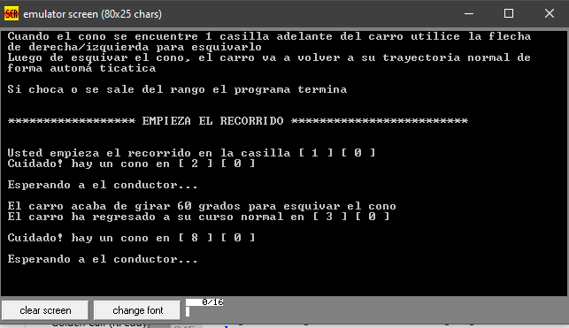

<br />
<p align="center">
  <h2 align="center">Car simulation</h3>
  <p align="center">
    This is a very simple "game" in console, you advance through the track using the left and right arrows, you avoid the obstacles using the up arrow, if you don't avoid the obstacle or get out the track the game is over
    <br />
  </p>
</p>


<!-- TABLE OF CONTENTS -->
## Table of Contents

- [Table of Contents](#table-of-contents)
- [About The Project](#about-the-project)
  - [Built With](#built-with)
- [Getting Started](#getting-started)
  - [Prerequisites](#prerequisites)
  - [Installation](#installation)
- [Usage](#usage)
- [Requirements](#requirements)
- [How does it work](#how-does-it-work)
- [Notes](#notes)


<!-- ABOUT THE PROJECT -->
## About The Project

This project was made for computer structure's subject


### Built With

* [x86 ASM](https://down01.wxsrv.com/descargando/024/2412/emu8086/057/emu8086.exe?val=2412&loc=descargar)
* [C](https://visualstudio.microsoft.com/es/downloads/)


<!-- GETTING STARTED -->
## Getting Started

To get a local copy up and running follow these simple steps.

### Prerequisites

* [emu 8086](https://down01.wxsrv.com/descargando/024/2412/emu8086/057/emu8086.exe?val=2412&loc=descargar)


### Installation

1. [Clone the repo](https://github.com/metalsonic21/CS-Route/archive/master.zip)
2. Compile the project


<!-- USAGE EXAMPLES -->
## Usage

Use the left arrow to move one slot to the left and the right arrow to move one slot to the right, if you are in for example the position 7 and the obstacle is at position 8 you should avoid that obstacle using the up arrow, otherwise the car will crash and the program finishes its execution.



## Requirements

1. Spanish interface
2. It should notify where the obstacle is
3. Once the car avoids the obstacle it should calculate the wheel angle rotation (use the formula you want)

## How does it work

1. To calculate the obstacle position the program generates a pseudo random number
2. Checks if a key is pressed and if that key is the up, left or right arrows, depending of which arrow is pressed it will execute a different action: (up = avoid obstacle, left = move to the left, right = move to the right)
3. After an obstacle is avoided it calculates the angle of rotation, the teacher let us to create any formula even if it doesn't make sense in the reality, I used the following:
   ```
   [(a,b)*(a-1,b-1)]*10 mod 90
   ```
4. After avoiding the obstacle the car comes back to its straight line path

## Notes

This program was firstly written in C using the _asm function in some parts in order to understand how assembly works and make easier writing the full program in pure x86 assembly without getting lost, you can compile the C version of this program using Visual Studio 2017, however the C version of this program doesn't work with the arrows.